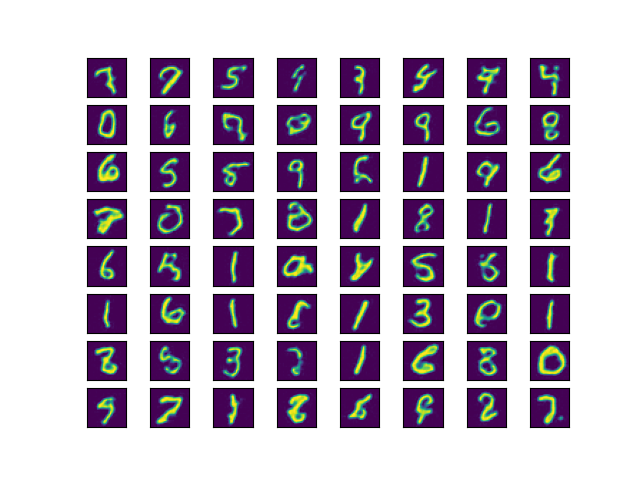

# VqvaePixelSNAIL
An implementation of PixelSNAIL https://arxiv.org/abs/1712.09763 to learn a prior over the latent space as encoded by a VQVAE https://arxiv.org/abs/1711.00937. Written in JAX/Haiku. The code for the VQVAE is taken from the Haiku repository at https://github.com/deepmind/dm-haiku.

